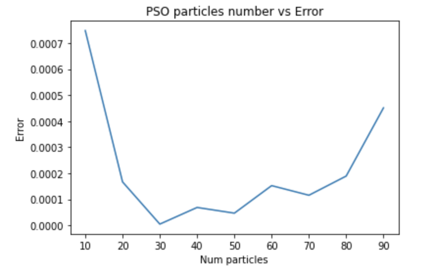

# Particle Swarm Optimization vs Gradient Descent

* Algorithm - 
  1. PSO 
  2. Gradient Descent
* Benchmarks -
  1. [Rosenbrock Function](https://en.wikipedia.org/wiki/Rosenbrock_function)
  2. [Rastrigin Function](https://en.wikipedia.org/wiki/Rastrigin_function)

### Results - 
* PSO on Rosenbrock -
  * 
  
* PSO on Rastrigin -
  * 

---
* GD on Rosenbrock - 
  * 
  
* GD on Rastrigin - 
  * 
  
## Experiment 1 - 
Running ~50 iterations of PSO and GD independently to generate probability distribution of error against density - 

  
## Observation 1 - 
While PSO is actively able to achieve the global minima or has very low error, Gradient Descent proves to be ineffective on the benchmarks mentioned.

## Experiment 2 - 
Effect of Error vs Number of particles in PSO - 

## Experiment 3 - 
Effect of Inertia parameter('a') for velocity update as stated in State of Art - Linearly decreasing the parameter from 0.9 to 0.4 over the defined iterations.

Therefore, we observer that while the error reduces with SOTA params, the difference is not really drastic.

## Created with - 
1. [Dhruv Rathi](https://github.com/dhruv2601)
2. [Justus Erker](https://github.com/Justus-Jonas)
3. [Caio Guirado](https://github.com/caioguirado)
